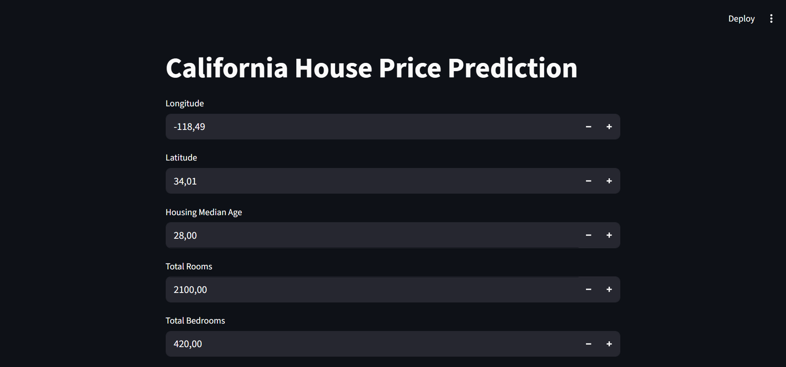

# California Housing Prices



**ML-сервис** для автоматической оценки стоимости недвижимости в Калифорнии с точностью **81%**, помогающий риелторам, инвесторам и банкам в оценке недвижимости в штате Калифорния. 

Проект включает визуализацию данных, обучение модели и создание веб-интерфейса с помощью FastAPI и Streamlit для взаимодействия c данными.

## Локальный запуск

1. Клонируйте репозиторий:

```bash
git clone https://github.com/BRSHD/housing-prices
cd housing-prices
```

2. Создайте виртуальное окружение для проекта с помощью `venv`:

```shell
python -m venv venv
source venv/bin/activate  # Linux/Mac
venv\Scripts\activate.ps1  # Windows
```

3. Установите зависимости проекта:

```shell
pip install -r requirements.txt
```

4. Запустите сервис с помощью команды:

```shell
uvicorn service:app
```

После запуска FastAPI будет доступен по адресу: http://localhost:8000

Документация API: http://localhost:8000/docs


5. Выполните команду для показа веб-интерфейса:

```shell
streamlit run app.py
```

После запуска Streamlit будет доступен по адресу: http://localhost:8501


## Данные

Открытый датасет [**California Housing Prices**](https://www.kaggle.com/datasets/camnugent/california-housing-prices).  

Размер: 20640 строк

Признаки:
- ***longitude:*** показатель того, насколько далеко на запад находится дом: чем больше значение, тем дальше на запад

- ***latitude:*** показатель того, насколько далеко на север находится дом: чем больше значение, тем дальше на север

- ***housingMedianAge:*** средний возраст дома в квартале: меньшее число соответствует более новому зданию

- ***totalRooms:*** Общее количество комнат в квартале

- **totalBedrooms:** Общее количество спален в квартале

- ***population:*** Общее количество людей, проживающих в пределах квартала

- ***households:*** общее количество домохозяйств, группы людей, проживающих в пределах жилого помещения, для квартала

- ***medianIncome:*** средний доход домохозяйств в пределах жилого квартала (измеряется в десятках тысяч долларов США)

- ***oceanProximity:*** Расположение дома относительно океана/моря

Целевая переменная:

- ***medianHouseValue:*** средняя стоимость жилья для домохозяйств в пределах квартала (измеряется в долларах США)

## Технологии

- **Python 3.11+**
- **Scikit-learn**, **Pandas**, **NumPy**, **Matplotlib**, **Seaborn**
- **Streamlit** — веб-интерфейс для пользователя
- **FastAPI + Uvicorn** — REST API для инференса
- **Joblib** — сохранение обученных моделей
- **pydantic** - валидация данных и настройки для FastAPI
- **requests** - HTTP-запросы для взаимодействия с API

## Основные этапы 

✅Анализ и предобработка данных: удаление пропущенных значений, ограничение и удаление выбросов

✅Создание новых признаков и One-Hot Encoding для ocean_proximity

✅Анализ корреляций признаков

✅Обучение ансамблевых моделей(Random Forest и Gradient Boosting) с подбором гиперпараметров(с помощью RandomizedSearchCV) через 5-фолдную кросс-валидацию

✅Оценка метрик и выявление наиболее важных признаков

Для удобства взаимодействия созданы:
- **Streamlit**-приложение для визуализации и интерактивных предсказаний
- **FastAPI**-сервис для программного вызова модели через HTTP

## Результаты 

| | RMSE | MAE | MAPE | R² Score |
|:---:|:---:|:---:|:---:|:---:|
| Random Forest | 44021.74 | 29921.72 | 16.76 | 0.8101 |
| Gradient Boosting | 43247.14 |  30393.04 | 17.31 | 0.8167 |

Обе модели показывают хорошее качество, но **Gradient Boosting** немного лучше по RMSE(~774 меньшую) и R²(на 0,66% лучшую), в то время как **Random Forest** дает более точные предсказания в абсолютном выражении (MAE, MAPE).

Берём **Gradient Boosting**(так как он имеет чуть лучшую обобщающую способность), как инструмент быстрой оценки недвижимости.

- MAPE 17.31%, т.е. модель ошибается в среднем на 17%. 
- Объясняет 81% вариативности цен.

 *Оптимальные гиперпараметры:*
- `n_estimators`: 300
- `learning_rate`: 0.1
- `max_depth`: 3
- `min_samples_split`: 2
- `min_samples_leaf`: 4
- `subsample`: 1.0
- `max_features`: None
 
Ограничения: модель не учитывает инфляцию, рыночные циклы, состояние дома. 

## Лицензия

Этот проект распространяется под лицензией MIT. Подробнее см. в файле LICENSE.
  
